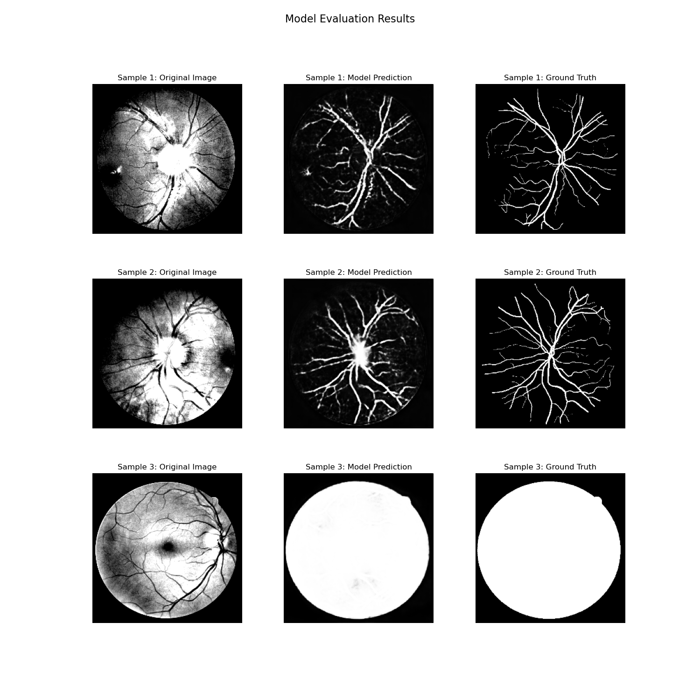

# Retinal-Vessel-UNet

**Retinal Blood Vessel Segmentation Using U-Net on DRIVE and Archive Fundus Datasets**

---

## Overview

This project trains a U-Net model to segment retinal blood vessels from fundus photographs. Given a raw eye fundus image, the model produces a binary mask that highlights the vessel tree. The pipeline covers multi-dataset preprocessing, augmented training with a combined Focal + Dice loss, and visual evaluation against expert-annotated ground truth masks.

Clinical motivation: accurate retinal vessel segmentation supports automated screening for diabetic retinopathy, glaucoma, and hypertensive retinopathy.

---

## Results

Three test samples from the evaluation run, showing original fundus image, model prediction, and expert ground truth side by side:



The model correctly traces major vessel branches in samples 1 and 2, and accurately identifies the circular field-of-view mask in sample 3.

---

## Architecture

A standard 4-level U-Net with skip connections:

```
Input [256×256×3]
        │
Encoder
  e1: Conv(32) × 2 + BN + ReLU → skip1  →  MaxPool
  e2: Conv(64) × 2 + BN + ReLU → skip2  →  MaxPool
  e3: Conv(128)× 2 + BN + ReLU → skip3  →  MaxPool
  e4: Conv(256)× 2 + BN + ReLU → skip4  →  MaxPool
        │
Bottleneck
        │
Decoder
  d4: Upsample → Conv(512)× 2 + BN + ReLU → concat(skip4)
  d3: Upsample → Conv(256)× 2 + BN + ReLU → concat(skip3)
  d2: Upsample → Conv(128)× 2 + BN + ReLU → concat(skip2)
  d1: Upsample → Conv(64) × 2 + BN + ReLU → concat(skip1)
        │
  Conv2D(1, 1×1) + Sigmoid
        │
Output mask [256×256×1]
```

Upsampling mode is configurable: bilinear (`UpSampling2D`) or learnable (`Conv2DTranspose`).

---

## Loss Function

Training uses a weighted combination of two losses to address the severe class imbalance between vessel pixels and background:

```
Loss = 0.7 × Focal Loss + 0.3 × Dice Loss
```

Focal Loss down-weights easy background pixels and focuses learning on hard vessel boundaries. Dice Loss directly optimises the overlap between predicted and ground-truth masks.

---

## Datasets

| Dataset | Training | Test | Format | Notes |
|---|---|---|---|---|
| DRIVE | 20 images | 20 images | `.tif` + `.gif` mask | Standard retinal segmentation benchmark |
| Archive | 40 images | remainder | `.jpg` + `.png` mask | Additional fundus photographs |

Raw data is not included. Place it under `raw/DRIVE/` and `raw/archive/` before running preprocessing.

---

## Project Structure

```
Retinal-Vessel-UNet/
├── preprocess.py           # CLAHE + Gamma correction + dataset split → preprocessed/
├── dataloader.py           # tf.data pipeline with augmentation
├── model.py                # U-Net (EncodeBlock, DecodeBlock, Unet)
├── train.py                # Training loop, callbacks, combined loss
├── evalute.py              # Load weights, run predictions, visualise results
├── evaluation_results.png  # Sample output (generated by evalute.py)
├── requirements.txt        # Python dependencies
│
├── raw/
│   ├── DRIVE/
│   │   ├── training/
│   │   │   ├── images/     # .tif fundus images
│   │   │   └── mask/       # .gif vessel masks
│   │   └── test/
│   │       ├── images/
│   │       └── mask/
│   └── archive/
│       ├── Image*.jpg      # Fundus images
│       └── *_1stHO.png     # Corresponding masks
│
└── preprocessed/
    ├── training/
    │   ├── images_pre/     # Preprocessed PNG images
    │   └── mask/           # Binary PNG masks
    └── test/
        ├── images_pre/
        └── mask/
```

---

## Preprocessing

Each image goes through three steps before training:

1. **CLAHE** (Contrast Limited Adaptive Histogram Equalisation, clip=2.0, tile=8×8) — enhances vessel contrast
2. **Gamma correction** (γ = 1.2) — compensates for dark imaging conditions
3. **Normalisation** — pixel values scaled to [0, 1]

Masks are binarised at threshold 128 and saved as single-channel PNG files. The archive dataset uses the first 40 images as training and the remainder as test.

```bash
python preprocess.py
```

---

## Training

```bash
python train.py \
  --logdir logs \
  --batch_size 4 \
  --epochs 100 \
  --learning_rate 0.0001
```

Add `--transpose_conv` to use `Conv2DTranspose` instead of bilinear upsampling.

Training callbacks: `ReduceLROnPlateau` (patience=5, factor=0.2), `EarlyStopping` (patience=15), `ModelCheckpoint` (best Dice), `TensorBoard`.

Best weights are saved to `logs/best_model` and final weights to `logs/final_model`.

---

## Evaluation

```bash
python evalute.py
```

Loads `logs/final_model`, randomly selects 3 test samples, runs inference, and saves a 3×3 comparison grid (`evaluation_results.png`) showing original image, model prediction, and ground truth for each sample.

---

## Metrics

The model is evaluated on Dice coefficient, binary accuracy, precision, and recall, monitored per epoch via TensorBoard:

```bash
tensorboard --logdir logs/logs
```

---

## License

This repository is released for academic and non-commercial use only.

Copyright © 2024 Merlin. All rights reserved.

THIS SOFTWARE IS PROVIDED "AS IS" WITHOUT WARRANTY OF ANY KIND.
